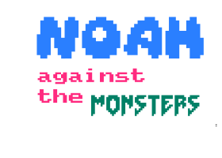
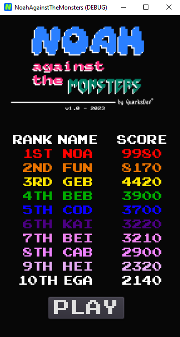
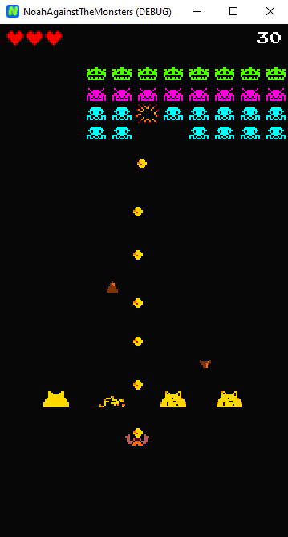

<div align="center">

# [NOAH] Against The Monsters Game

A retro-style game for the strongest. Have fun!

> Status: v1.1.0.0 released


</div>

```
Resources:

Music: 19th Floor (Song by Bobby Richards - YouTube Audio Library)
Engine: Godot 3.5.1
Creation of icons & images: Inkscape 1.2 & Paint.net 5.0.2
Editing extra files: VS Code 1.76.0
Favicon: realfavicongenerator.net
Developer: Marc Freir @ QuarksDev - 2023
```
> Licence: BSD 3-Clause

<div align="center">

#### If you have any question or tips, please send a message:

<!--Telegram-->
<a href="https://t.me/quarksdev"></a>
</div>


<div align="center">

> SCREENSHOTS



</div>